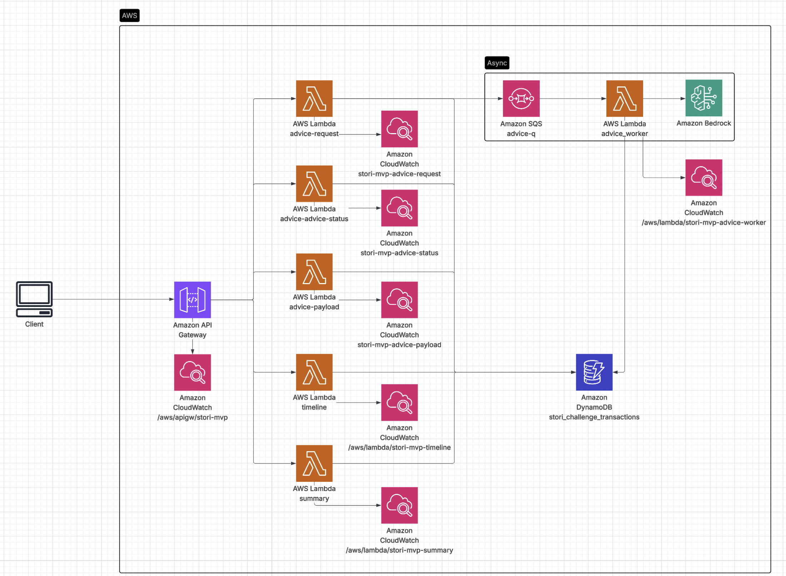
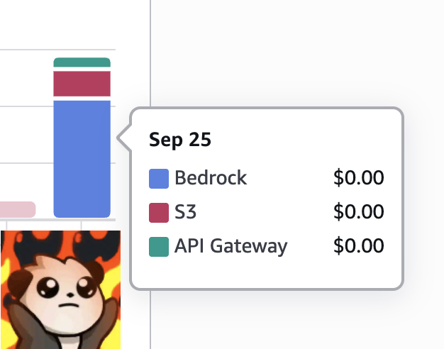

# Stori Challenge – Finance AI (Serverless, Bedrock)

A production-minded, serverless system that turns raw transactions into **instant budget insights** and an **AI coaching** experience. It combines fast, deterministic aggregation with an asynchronous LLM pipeline (AWS Bedrock), so the UI stays snappy while heavyweight generation runs off the critical path.

> TL;DR:  
> Frontend asks for a quick **payload preview**, then fires an **idempotent job** to Bedrock via SQS.  
> A worker Lambda generates the final advice, persists it in DynamoDB, and the FE polls with backoff.  
> Clear separation of concerns, least-privilege IAM, and a clean DX to run locally or in AWS.

---

## Highlights

- **Fast perceived UX**: `/api/advice/payload` returns in ~100–300ms; the UI shows an actionable preview immediately.
- **Asynchronous LLM**: `/api/advice` enqueues work; a **worker** Lambda calls Bedrock and updates Dynamo.
- **Idempotent jobs**: same filters → same `jobId` (hash). Reuses completed advice and avoids duplicates.
- **Robust parsing**: strips `<reasoning>...</reasoning>` and extracts only the final, user-facing text.
- **Serverless all the way**: API Gateway (HTTP), Lambda (Node.js 20), DynamoDB, SQS, CloudWatch logs.
- **Least-privilege IAM**: separate execution roles; Bedrock permissions only for the worker.
- **Operability**: structured logs, backoff + jitter polling, safe defaults for timeouts/visibility.

---

# Setup & Run (End-to-End)

## Prerequisites
- AWS account with Bedrock access (model: openai.gpt-oss-20b-1:0 works without pre-approval).
- CLI/tools: AWS CLI v2, Terraform ≥ 1.6, Node.js ≥ 18, npm, git.
- Profile: these docs assume:
```
export AWS_PROFILE=stori-mvp
export AWS_REGION=us-east-1
```

### IAM user & local AWS profile (for Terraform)
- Create a programmatic IAM user dedicated to this project and configure a local AWS profile so terraform and the Makefile use it consistently.
- Create the IAM user (e.g., stori-mvp-terraform) and download its access keys.
- Attach a practical policy (inline or managed). For a demo/MVP this set is fine; you can tighten resources later:

```
{
    "Version": "2012-10-17",
    "Statement": [
        {
            "Effect": "Allow",
            "Action":["apigateway:*","lambda:*","logs:*","cloudwatch:*","dynamodb:*","iam:CreateRole","iam:DeleteRole","iam:GetRole","iam:PassRole","iam:AttachRolePolicy","iam:DetachRolePolicy","iam:PutRolePolicy","iam:DeleteRolePolicy","iam:TagRole","iam:UntagRole","iam:ListInstanceProfilesForRole","iam:ListRolePolicies","iam:ListAttachedRolePolicies","iam:ListRoleTags","iam:CreatePolicy","iam:TagPolicy","iam:GetPolicy","iam:GetRolePolicy","iam:GetPolicyVersion","iam:ListPolicyVersions","iam:CreatePolicyVersion","iam:DeletePolicy","iam:DeletePolicyVersion","sqs:createqueue","sqs:tagqueue","sqs:getqueueattributes","sqs:listqueuetags","sqs:deletequeue","sqs:setqueueattributes"],
            "Resource": "*"
        }
    ]
}
```
- Configure your local profile (the Makefile defaults to stori-mvp and us-east-1):

```
aws configure --profile stori-mvp
# AWS Access Key ID: <paste>
# AWS Secret Access Key: <paste>
# Default region name: us-east-1
# Default output format: json
```
- Use the profile when working in /infra (Makefile picks these up automatically):

```
export AWS_PROFILE=stori-mvp
export AWS_DEFAULT_REGION=us-east-1

make whoami   # sanity check
make up       # terraform init/plan/apply + outputs
make test     # smoke test endpoints

```

>Note: If you enable DynamoDB deletion protection in Terraform, you’ll need to manually turn it off before make down (destroy).

### Load mock data into DynamoDB
This repo includes a Node script to batch-write the mock transactions into DynamoDB.
- Table: stori_challenge_transactions (PK=pk, SK=sk)
- Input file expected by the script: ./mock_expense_and_income.json (at the repo root)
  
*Import command (macOS/Linux)*
```
# Run from the repo root
AWS_PROFILE=stori-mvp AWS_REGION=us-east-1 \
TABLE_NAME=stori_challenge_transactions \
node scripts/import-dynamo.js
```

*Verify the data*
```
aws dynamodb scan \
  --table-name stori_challenge_transactions \
  --max-items 5 \
  --output table \
  --region us-east-1 --profile stori-mvp

```
*Troubleshooting*
- Missing TABLE_NAME → Ensure you pass TABLE_NAME=stori_challenge_transactions.
- File not found → Confirm mock_expense_and_income.json exists at the repo root.
- Region/profile mismatch → Check AWS_REGION and AWS_PROFILE match your deployed table.

## 1) Configure AWS profile (one-time)

```
aws configure --profile stori-mvp
# Region: us-east-1
# Output: json
```

## 2) Clone & install layer deps

```
git clone <your-repo-url> stori-finance-ai
cd stori-finance-ai

# Install the shared Lambda layer dependencies
pushd layers/dynamo/nodejs
npm ci
popd

```

> Terraform will also run `npm ci` via a `null_resource`, but doing it once here makes the first apply faster and fails earlier if something’s wrong.

## 3) Terraform variables (dev defaults)

Create `terraform.tfvars` at the repo root (edit as needed):

```
aws_region                = "us-east-1"
project_name              = "stori-mvp"

lambda_timeout_s          = 10
lambda_memory_mb          = 512

lambda_timeout_s_advice   = 300
lambda_memory_mb_advice   = 1536

log_retention_days        = 7

# For local dev: allow your frontend origin
cors_allowed_origins      = ["http://localhost:5173"]

```

## 4) Provision AWS infra
```
terraform init
terraform apply -auto-approve
```

or 
```
make up
```

What this creates:
 - HTTP API (API Gateway v2) with routes:
 - `GET /api/summary`, `GET /api/timeline`
 - `GET /api/advice/payload`, `POST /api/advice`, `GET /api/advice/status`
 - Lambdas: `summary`, `timeline`, `advice-payload`, `advice-request`, `advice-status`, `advice-worker`
 - SQS: advice queue (+ optional DLQ if configured)
 - DynamoDB: `stori_challenge_transactions`
 - CloudWatch log groups and IAM with least privilege

## 5) Get the API base URL

If you already output it via Terraform, run:
`terraform output`

Otherwise:

```
API_NAME="stori-mvp-http-api" # project_name + "-http-api"
API_BASE=$(aws apigatewayv2 get-apis \
  --query "Items[?Name=='${API_NAME}'].ApiEndpoint" \
  --output text)
echo "$API_BASE"
# Example: https://abc123.execute-api.us-east-1.amazonaws.com
```

## 6) Frontend config & run (Vite)

```
cd dashboard
npm i
```
Create local env with 
`"VITE_API_BASE_URL=${PREVIOUS_OUTPUT_HERE}"`

```
npm run dev
# open http://localhost:5173

```

## 7) Quick sanity checks (curl)
```
# Summary (fast)
curl "$API_BASE/api/summary?from=2024-01-01&to=2025-09-24"

# Advice payload (fast)
curl "$API_BASE/api/advice/payload?from=2024-01-01&to=2025-09-24&topN=5&exclude=rent,healthcare"

# Create/reuse advice job (async)
JOB=$(curl -s -X POST "$API_BASE/api/advice" \
  -H 'Content-Type: application/json' \
  -H 'X-AI-Mode: bedrock' \
  -d '{"from":"2024-01-01","to":"2025-09-24","topN":5,"exclude":["rent","healthcare"]}')
echo "$JOB"

# Poll status
JOB_ID=$(echo "$JOB" | jq -r .jobId)
curl "$API_BASE/api/advice/status?jobId=${JOB_ID}"

```


## 8) Verify SQS & Worker (optional but useful)

```
# Queue URL & backlog
QUEUE_URL=$(aws sqs get-queue-url --queue-name stori-mvp-advice-q --output text)
aws sqs get-queue-attributes \
  --queue-url "$QUEUE_URL" \
  --attribute-names ApproximateNumberOfMessages ApproximateNumberOfMessagesNotVisible \
  --output table

# Event source mapping (SQS -> advice-worker)
aws lambda list-event-source-mappings \
  --function-name stori-mvp-advice-worker \
  --output table

```

## 9) Logs (debugging)
```
# Request path (enqueues job)
aws logs tail "/aws/lambda/stori-mvp-advice-request" --since 15m --follow

# Worker path (Bedrock + persist result)
aws logs tail "/aws/lambda/stori-mvp-advice-worker" --since 15m --follow
```

## 10) DynamoDB: quick peek

```
aws dynamodb scan \
  --table-name stori_challenge_transactions \
  --max-items 5 \
  --output table
```

Jobs are stored under `pk = "adviceJob#<jobId>", sk = "meta"`.

## Common pitfalls (and fixes)

- CORS error in browser
  Make sure your dev origin is listed in cors_allowed_origins (e.g., `http://localhost:5173`) and re-apply.

- InvalidClientTokenId / credentials
  Your AWS session/profile expired. Re-run aws configure or refresh SSO, then terraform apply again.

- SQS visibility timeout < Lambda timeout
  Error on event source mapping creation. Set SQS visibility_timeout_seconds greater than the worker’s timeout (e.g., 360s vs 300s).

- Job stuck in queued
  Check advice-request logs for sendMessage OK. If messages exist in SQS but worker doesn’t run, check the event source mapping state and worker logs.

---

# Architecture



```
[ Client / Frontend ] 
        |
        v
[ API Gateway (HTTP API v2, $default, CORS) ]
   ├── GET /api/summary     ──► [Lambda: summary]  ┐
   ├── GET /api/timeline    ──► [Lambda: timeline] ├─► [DynamoDB: stori_challenge_transactions]
   ├── GET /api/advice/payload ► [Lambda: advice_payload] │
   ├── GET /api/advice/status  ► [Lambda: advice_status]  │
   └── POST /api/advice        ► [Lambda: advice_request] ┘
                                    │
                                    ▼
                               [ SQS: advice-q ]
                                    │ (event source mapping)
                                    ▼
                             [ Lambda: advice_worker ]
                                    │
                                    ▼
                           [ Bedrock: InvokeModel* ]

```

---

## Data model (DynamoDB)

Single table design (`stori_challenge_transactions`):

- **Transactions**: `{ pk: 'txn#USER'|'...' , sk: ISO_DATE, type: 'income'|'expense', amount, category, description, date }`
- **Advice jobs**:
  - `pk: "adviceJob#<jobId>", sk: "meta"`
  - Attributes: `status: queued|running|done|error`, `filters`, `advice { text, structured?, payloadSlim, filters }`,
    timestamps: `createdAt`, `startedAt`, `finishedAt`, `lastRequeuedAt`, `enqueueCount`

`jobId` is deterministic: `sha1({from,to,topN,exclude[]}).slice(0,16)`

---

## Endpoints

### 1) Quick preview (sync)
```
GET /api/advice/payload?from=YYYY-MM-DD&to=YYYY-MM-DD&topN=5&exclude=rent,healthcare
```
Returns summarized spend (top category + top lines). Used to render an instant “preview” in the UI.

### 2) Create / reuse job (async)
```
POST /api/advice
Body: { from, to, topN, exclude }
→ 202 { jobId, status: "queued"|"running"|"done" }
```
Idempotent: if a finished job exists, backend may respond with `status: "done"` (and FE then calls `status`).

### 3) Poll status
```
GET /api/advice/status?jobId=<id>
→ { jobId, status, advice? , error? }
```

**Curl example**
```bash
curl "$API_BASE/api/advice/payload?from=2024-01-01&to=2025-09-24&topN=5&exclude=rent,healthcare"

curl -X POST "$API_BASE/api/advice" \
  -H 'Content-Type: application/json' \
  -H 'X-AI-Mode: bedrock' \
  -d '{"from":"2024-01-01","to":"2025-09-24","topN":5,"exclude":["rent","healthcare"]}'

curl "$API_BASE/api/advice/status?jobId=f7679fc5552e63ab"
```

---

## IAM & Security

- Separate roles:  
  - `lambda_exec` → summary/timeline + Dynamo (R/W)  
  - `lambda_exec_advice` → advice* + Dynamo (R/W), SQS (send/consume), **Bedrock invoke** (worker only)
- No credentials in code; configuration via environment variables.
- CORS restricted to the FE origin (configurable).
- Data encrypted at rest (Dynamo/SQS default) and in transit (HTTPS).

---

## 🚀 Deploy

**Prereqs**: AWS CLI configured, Node 18+, Terraform.

```bash
export AWS_PROFILE=stori-mvp
export AWS_REGION=us-east-1

# Build layer deps
pushd layers/dynamo/nodejs && npm ci && popd

# Terraform
terraform init
terraform apply -auto-approve
```

Outputs include API base URL. Set it in the FE:

```
VITE_API_BASE_URL="https://xxxxx.execute-api.us-east-1.amazonaws.com"
```

---

## Local dev (frontend)

```bash
cd web
npm i
VITE_API_BASE_URL=https://xxxxx.execute-api.us-east-1.amazonaws.com npm run dev
```

The Advice card:
- Calls `/api/advice/payload` → renders **preview** immediately.
- `POST /api/advice` → gets `{jobId,...}`.
- **Always** hits `/api/advice/status` once right away.  
  If not `done`, runs a **backoff + jitter** polling loop until `done/error` or max attempts.

---

## 🧪 Operability & Debugging Runbook

1) **See requests**: CloudWatch Logs  
   - `/aws/lambda/<project>-advice-request` → look for `sendMessage OK`
   - `/aws/lambda/<project>-advice-worker`  → `Job done` or error stack
2) **SQS health**
   ```bash
   aws sqs get-queue-attributes --queue-url "$QUEUE_URL" \
     --attribute-names ApproximateNumberOfMessages ApproximateNumberOfMessagesNotVisible
   ```
   - `>0` visible messages + mapping enabled → worker should process.
3) **Event source mapping**
   ```bash
   aws lambda list-event-source-mappings --function-name <project>-advice-worker
   ```
4) **Common pitfalls**
   - `InvalidParameterValue: visibility timeout < function timeout`  
     → Raise SQS visibility or lower Lambda timeout.
   - API Gateway “Cannot delete Integration … referenced by Route”  
     → Terraform order: remove Route → then Integration.
   - `InvalidClientTokenId`  
     → AWS profile/credentials expired; refresh and retry.
   - CORS error in FE  
     → Ensure API Gateway CORS allows your FE origin.

---

## LLM Output Handling

Some models (e.g., OSS via Bedrock) prepend **reasoning**. We:
- **Forbid** chain-of-thought in the prompt (instructional guardrails).
- **Strip** `<reasoning>...</reasoning>` blocks server-side.
- Extract a final JSON (if present inside ```json ... ```), otherwise return clean text.
- If tokens truncate, we still show a **preview** computed from `payloadSlim`.

---

## Cost & Performance Controls

- Async Bedrock invocation (compute isolated in worker).
- Token caps via `BEDROCK_MAX_TOKENS`.
- No model calls if the user never hits advice (payload alone is cheap).
- Caching by `jobId` (reuse of finished jobs).
- Polling uses exponential backoff + jitter.

---

## Design decisions & trade-offs

- **SQS over long API timeouts**: decouples latency, enables retries, and scales workers independently.
- **Single table Dynamo**: simple, affordable, and fast for this workload; scans acceptable for challenge scale.
- **Idempotency**: deterministic `jobId` prevents duplication and supports “replay”.
- **FE user experience**: “preview first” pattern hides model latency and still delivers value.

---

## Cost snapshot

At demo traffic levels the infra basically costs nothing because of serverless + free-tier friendly architecture.


> ChatGPT advised me *not* to paste this image here.  